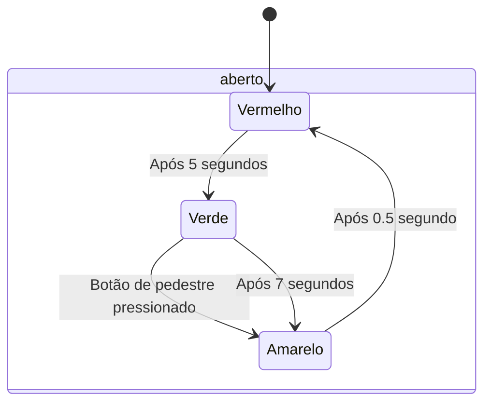

# Semáforo  

Nas atividades anteriores, você deu os primeiros passos na implementação de circuitos síncronos. Agora que já domina esse conceito, é hora de avançar e explorar um novo tema essencial no projeto de sistemas digitais: as **máquinas de estados**.

> O objetivo desta atividade é exercitar o projeto e a construção de máquinas de estados por meio da implementação de um **semáforo com sinal para pedestres**.  

---

## Atividade  

Seu objetivo é escrever um módulo em **Verilog** chamado `Semaphore`, que deve atender aos seguintes requisitos:  

### **Parâmetro:**  
- `CLK_FREQ`: Representa a frequência do clock.  

### **Entradas:**  
- `clk`: Clock do sistema.  
- `rst_n`: Reset ativo em nível **baixo**.  
- `pedestrian`: Botão de pedestre, ativo em nível **alto**.  

### **Saídas:**  
- `green`: Sinal de 1 bit indicando que o semáforo está **verde**.  
- `yellow`: Sinal de 1 bit indicando que o semáforo está **amarelo**.  
- `red`: Sinal de 1 bit indicando que o semáforo está **vermelho**.  

---

## Funcionamento do Semáforo  

O semáforo segue o seguinte ciclo:  

1. **Inicialização:** Ao ser resetado, o semáforo começa **fechado** (luz vermelha acesa).  
2. **Vermelho (Fechado):** Dura **5 segundos**.  
3. **Verde (Aberto):** Dura **7 segundos**.  
4. **Amarelo (Transição para Vermelho):** Dura **0,5 segundo**.  
5. **Volta ao estado fechado (Vermelho)** e o ciclo se repete.  

### **Botão de Pedestre**  
Caso a entrada `pedestrian` seja acionada enquanto o semáforo está **verde**, ele deve **imediatamente** passar para **amarelo**, interrompendo o ciclo normal.  

A máquina de estados do semáforo pode ser representada pelo diagrama abaixo:  

> Se não conseguir ver o diagrama, baixe a extensão do vscode "Markdown Preview Mermaid Support"



> **Dica:** Utilize a frequência do clock (`CLK_FREQ`) para calcular os tempos corretamente.  

---

## Código Inicial  

Como ponto de partida, utilize o esqueleto de código abaixo:  

```verilog
module Semaphore #(
    parameter CLK_FREQ = 25_000_000
) (
    input  wire clk,
    input  wire rst_n,
    input  wire pedestrian,
    output wire green,
    output wire yellow,
    output wire red
);
    
    // Sua implementação da máquina aqui

endmodule
```

---

## Execução da atividade

Siga o modelo de módulo já fornecido e utilize o testbench e scripts de execução para sua verificação. Em seguida, implemente o circuito de acordo com as especificações e, se necessário, crie outros testes para verificá-lo.

Uma vez que estiver satisfeito com o seu código, execute o script de testes com `./run-all.sh`. Ele mostrará na tela `ERRO` em caso de falha ou `OK` em caso de sucesso.

## Entrega  

Para submeter o projeto, basta fazer um *commit* no repositório do **GitHub Classroom**. O sistema de correção automática já está configurado para validar sua implementação e atribuir uma nota com base nos testes.  

> **Dica:**  
Os testes do GitHub estão embutidos nos arquivos do laboratório. Para entender melhor como funcionam, consulte o script de correção `run.sh` no repositório. **Não altere os arquivos de correção!**  

